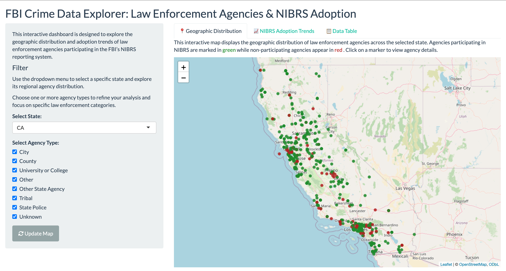

# FBI Crime Data Explorer-Law Enforcement Agencies NIBRS Adoption

## Introduction
This project explores law enforcement agency participation in the FBI’s Uniform Crime Reporting (UCR) Program, specifically focusing on NIBRS (National Incident-Based Reporting System) data from the FBI Crime Data Explorer. The dataset includes agency types and geographic details across all 50 U.S. states.

Key questions:

  **1. How do agency types vary across states?**

  **2. What percentage of agencies participate in NIBRS reporting, and how has adoption changed over time?**

## Motivation
Analyzing participation patterns allows us to:

   - Identify gaps in reporting by region or agency type

   - Evaluate the effectiveness of federal data collection initiatives

   - Support more transparent and complete crime data reporting

## Visualization and Dashboard Design
I created an interactive Shiny dashboard that allows users to:

  - View geographic distribution of participating vs. non-participating agencies

  - Analyze NIBRS adoption trends over time

  - Examine raw data through an interactive table

## Dashboard Walkthrough 

 The [Interactive Dashboard](https://jasmineyu-works-1688.shinyapps.io/nibrs-dashboard/) includes three tabs:

  **1. Geographic Distribution: Interactive map with clickable markers (green = NIBRS participants, red = non-participants)**
  

  **2. NIBRS Adoption Trends: Line chart of cumulative adoption over time by agency type**

  **3. Data Table: Filterable table of all agencies and attributes**

## Conclusion
This project demonstrates the power of data visualization to uncover patterns in public safety reporting. By analyzing the FBI's NIBRS dataset, we can promote transparency and support more consistent data practices among law enforcement agencies nationwide.
